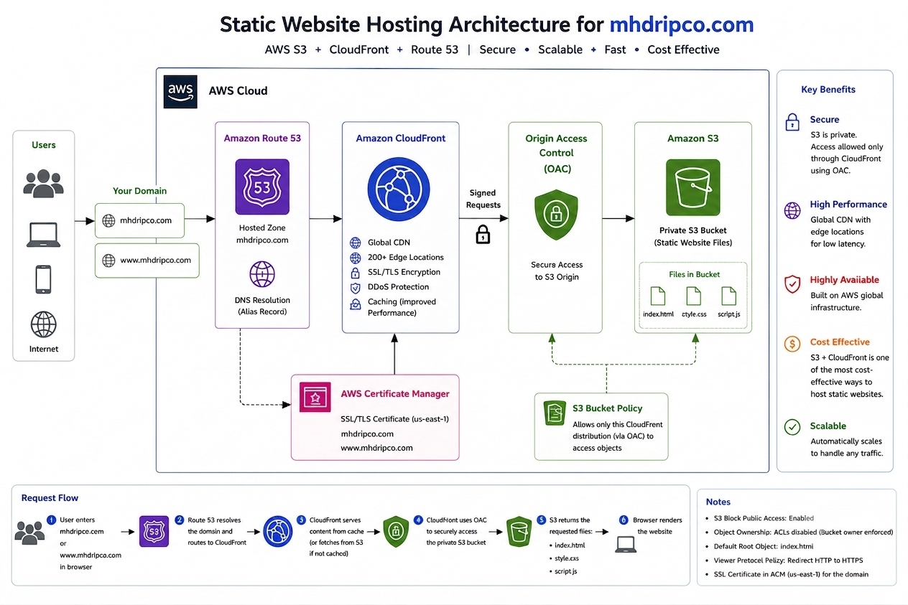

# AWS Static Website Hosting with S3, CloudFront & Route 53

## Live Website
https://mhdripco.com

## Project Overview
This project demonstrates hosting a static website on AWS using Amazon S3, Amazon CloudFront, Route 53, AWS Certificate Manager (ACM), and Origin Access Control (OAC).

## Architecture

## AWS Services Used

- Amazon S3
- Amazon CloudFront
- Amazon Route 53
- AWS Certificate Manager (ACM)
- Origin Access Control (OAC)

## Features

- Static website hosting
- HTTPS using ACM
- Custom domain (mhdripco.com)
- Global CDN with CloudFront
- Private S3 bucket
- Secure access using OAC

## Security Considerations

- S3 Block Public Access enabled
- Bucket Owner Enforced (ACLs disabled)
- Origin Access Control (OAC)
- HTTPS only
- CloudFront accesses S3 using signed requests

## Estimated Cost

| Service | Estimated Monthly Cost |
|---------|------------------------|
| S3 | Free Tier / Low |
| CloudFront | Free Tier / Low |
| Route 53 | ~$0.50 per hosted zone |
| ACM | Free |

## Technologies

- HTML
- CSS
- JavaScript
- AWS
